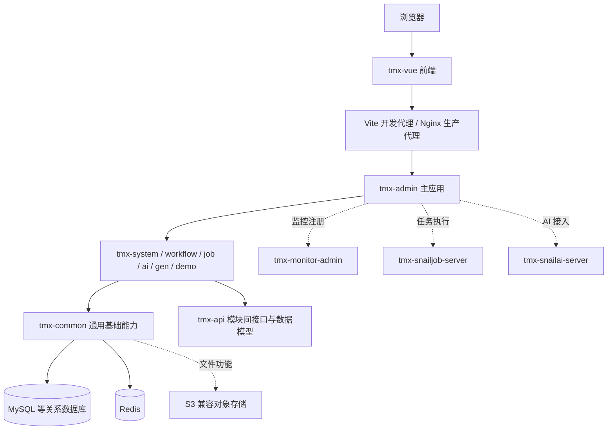
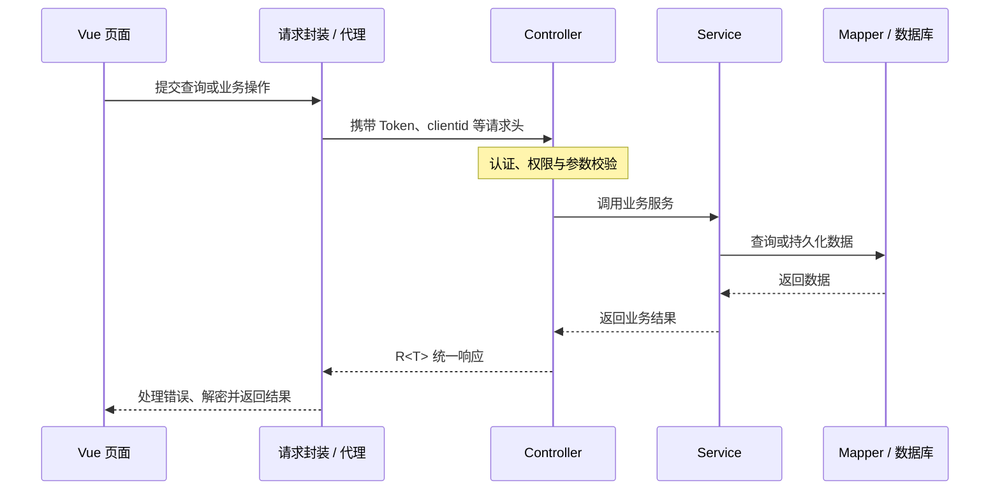

# tmx

**tmx 是面向业务开发的可扩展后台模板。`tm` 表示模板，`x` 表示扩展。**

项目提供用户权限、组织管理、系统配置、文件存储、消息通知、工作流、任务调度和 AI 接入等通用能力，作为新业务系统的基础工程。配套前端为 [tmx-vue](../tmx-vue/README.md)。

当前工程版本为 `6.0.0`，Maven 根坐标为 `org.tmx:tmx`，Java 根包为 `org.tmx`。版本暂沿用原工程，具体依赖以 [pom.xml](pom.xml) 为准。

## 快速启动

启动顺序：**数据库 / Redis → 后端 → 前端**。先跑通基础管理功能，再按需接入对象存储、调度中心、监控中心和 AI 服务。

Before the first build, copy `tmx-admin/src/main/resources/application.example.yml` to `application.yml` and `application-dev.example.yml` to `application-dev.yml`, then enter your local database and Redis settings. For optional modules, copy their `application*.example.yml` files to matching `application*.yml` names. Check all committed settings before using this template outside a development environment.

### 1. 检查 Java 环境

```powershell
Set-Location 'F:\_personal\_projects\tmx'
java -version
.\mvnw.cmd --version
```

项目编译目标为 **Java 21**。如果终端显示 Java 8，先切换 JDK；修改 IDE 的 JDK 不会自动修改终端的 `JAVA_HOME`。

当前机器已安装 `D:\_devTools\_supports\Java\jdk-25.0.3`，可仅在本次 PowerShell 窗口中使用它；其他机器请将路径替换为实际安装的 JDK 21 或兼容版本：

```powershell
$env:JAVA_HOME = 'D:\_devTools\_supports\Java\jdk-25.0.3'
$env:Path = "$env:JAVA_HOME\bin;$env:Path"
java -version
.\mvnw.cmd --version
```

### 2. 准备数据库、Redis 与配置

1. 启动 MySQL 和 Redis。
2. **仅首次创建空库时**，创建 `tmx` 数据库并导入 `script/sql/tmx.sql`、`script/sql/tmx_workflow.sql`。工作流当前默认启用，已有数据库不要重复导入。完整操作见 [数据库初始化](#数据库初始化)。
3. 检查 [application-dev.yml](tmx-admin/src/main/resources/application-dev.example.yml) 中的数据库 URL、用户名、密码，以及 Redis 地址、端口、密码。不要直接沿用其他环境的地址。
4. 基础启动不需要先启用 SnailJob、Snail AI 或监控中心；使用相应功能时再部署服务并调整配置。

### 3. 构建并启动后端

在后端根目录运行，PowerShell 中将 Maven profile 参数加引号：

```powershell
Set-Location 'F:\_personal\_projects\tmx'
.\mvnw.cmd -P 'dev,gen' -pl tmx-admin -am -DskipTests package
java -jar tmx-admin/target/tmx-admin.jar --spring.profiles.active=dev
```

主应用默认监听 **http://localhost:8080**。保持这个终端运行，另开终端启动前端。也可以在 IDE 中导入根 `pom.xml`，完成 Maven 资源处理后运行 `org.tmx.TmxApplication`。

Linux / macOS 使用：

```bash
cd /你的路径/tmx
./mvnw -Pdev,gen -pl tmx-admin -am -DskipTests package
java -jar tmx-admin/target/tmx-admin.jar --spring.profiles.active=dev
```

### 4. 启动配套前端

前端使用 Node.js 22.23.1、项目指定的 pnpm 10.34.5：

```powershell
Set-Location 'F:\_personal\_projects\tmx-vue'
node --version
corepack pnpm --version
corepack pnpm install --frozen-lockfile
corepack pnpm dev
```

浏览器访问 **http://localhost:80**，实际端口以 Vite 输出为准。前端通过 `/dev-api` 转发请求到后端 8080 端口；安装报错与包管理器设置见 [前端快速开始](../tmx-vue/README.md#快速开始)。

## 目录

- [快速启动](#快速启动)
- [整体架构](#整体架构)
- [工程结构与模块职责](#工程结构与模块职责)
- [功能清单](#功能清单)
- [技术栈](#技术栈)
- [环境与配置](#环境与配置)
- [数据库初始化](#数据库初始化)
- [本地开发](#本地开发)
- [构建与部署](#构建与部署)
- [业务开发与扩展](#业务开发与扩展)
- [常见问题](#常见问题)
- [命名与迁移约定](#命名与迁移约定)
- [来源与许可证](#来源与许可证)

## 整体架构

项目采用**前后端分离 + Maven 多模块单体**架构。核心业务模块由 `tmx-admin` 装配成一个应用；监控中心、任务调度中心和 AI 服务是可单独运行的扩展应用。



- **前端层**：负责页面、菜单、路由、表单交互和用户状态，通过 HTTP 接口访问后端，通过 SSE 或 WebSocket 接收消息。
- **应用层**：`tmx-admin` 提供启动入口、认证入口和环境配置，装配业务及公共模块。
- **业务层**：每个业务模块按 Controller、Service、Mapper、Domain 分层，集中实现业务规则与数据访问。
- **公共能力层**：认证、数据权限、缓存、日志、对象存储、导入导出、加解密等能力供业务模块复用。
- **扩展服务层**：按需接入监控、调度和 AI 服务。多模块不代表每个模块都是独立微服务；当前没有要求将核心业务拆成独立进程。

### 一次请求如何流转



普通接口通常返回 `R<T>`，结构为 `{ code, msg, data }`。分页接口使用 `R<PageResult<T>>`，分页内容位于 `data.rows`、`data.total`。下载、流式消息等接口按自身协议返回。

## 工程结构与模块职责

```text
tmx/
├─ pom.xml                      Maven 聚合、统一依赖版本、构建配置
├─ mvnw / mvnw.cmd              Maven Wrapper
├─ .mvn/                        Wrapper 配置
├─ tmx-admin/                   主应用入口与环境配置
├─ tmx-api/                     模块间接口、模型与事件定义
├─ tmx-common/                  通用基础模块
├─ tmx-modules/                 业务模块
│  ├─ tmx-system/               系统管理、监控查询、文件与消息
│  ├─ tmx-workflow/             工作流业务与请假示例
│  ├─ tmx-job/                  分布式任务执行示例
│  ├─ tmx-ai/                   AI 用户与服务接入
│  ├─ tmx-gen/                  代码生成与模板
│  └─ tmx-demo/                 通用能力使用示例
├─ tmx-extend/                  可独立启动的扩展服务
│  ├─ tmx-monitor-admin/        Spring Boot Admin 监控中心
│  ├─ tmx-snailjob-server/      SnailJob 调度中心
│  └─ tmx-snailai-server/       Snail AI 服务
└─ script/
   ├─ sql/                     数据库初始化脚本
   ├─ docker/                  Compose、Nginx、Redis 等示例配置
   └─ bin/                     tmx.sh、tmx.bat 运行脚本
```

### 核心模块

| 模块 | 主要职责 | 使用方式 |
| --- | --- | --- |
| `tmx-admin` | Spring Boot 启动、登录认证入口、环境与服务装配 | 启动 `org.tmx.TmxApplication`，或运行 `tmx-admin.jar` |
| `tmx-api` | 系统、工作流等模块间接口及模型、事件 | 避免业务模块直接依赖彼此的内部实现 |
| `tmx-system` | 用户、角色、菜单、组织、文件、消息及监控查询 | 主应用默认引入 |
| `tmx-workflow` | 流程定义、实例、任务、分类、表达式与示例业务 | 依赖 WarmFlow，并使用 LiteFlow 编排任务办理链 |
| `tmx-job` | 普通任务、广播、分片、Map/MapReduce 等执行示例 | 启用客户端并接入调度中心 |
| `tmx-ai` | 当前用户 AI 身份注册等业务接入 | 配合 Snail AI 服务及模型配置使用 |
| `tmx-gen` | 表结构导入、生成配置、代码预览与生成 | 由 `tmx-admin` 的 `gen` Maven profile 控制装配 |
| `tmx-demo` | 列表、树、缓存、锁、加解密、消息等示例 | 新功能接入时参考对应示例，按业务需要裁剪 |

### 公共模块

下表模块均位于 `tmx-common/`。

| 模块 | 职责 |
| --- | --- |
| `tmx-common-bom` | 公共模块依赖版本管理 |
| `tmx-common-core` | 通用响应、分页结果、常量、异常、校验与工具 |
| `tmx-common-web` | Web 通用配置、参数处理、异常处理等 |
| `tmx-common-json` | JSON 序列化与扩展配置 |
| `tmx-common-mybatis` | 数据访问、分页、数据权限、查询扩展 |
| `tmx-common-redis` | Redis、缓存、分布式锁及相关公共能力 |
| `tmx-common-satoken`、`tmx-common-security` | 登录会话、认证授权及请求访问控制 |
| `tmx-common-log` | 操作日志记录 |
| `tmx-common-doc` | 接口文档与 JavaDoc 集成 |
| `tmx-common-excel` | Excel 导入导出 |
| `tmx-common-oss` | S3 兼容对象存储访问 |
| `tmx-common-mail`、`tmx-common-sms` | 邮件、短信发送接入 |
| `tmx-common-social` | 第三方登录接入 |
| `tmx-common-translation` | 字段值翻译 |
| `tmx-common-sensitive` | 数据脱敏 |
| `tmx-common-encrypt` | 接口和字段加解密 |
| `tmx-common-push` | 统一消息推送，支持 SSE / WebSocket |
| `tmx-common-job` | SnailJob 客户端公共配置 |
| `tmx-common-ai` | Snail AI 客户端公共接入 |
| `tmx-common-mcp` | Spring AI MCP 服务接入 |
| `tmx-common-liteflow` | LiteFlow 规则编排集成 |
| `tmx-common-elasticsearch` | Elasticsearch / Easy-ES 集成 |
| `tmx-common-mqtt` | MQTT 客户端集成 |

## 功能清单

“已包含”表示仓库中有对应代码或集成，不代表外部服务、账号和密钥已经配置完成。

| 分类 | 已包含的功能 | 主要模块 |
| --- | --- | --- |
| 登录与身份 | 账号登录、验证码、注册入口、退出登录、第三方登录、客户端管理 | `tmx-admin`、`tmx-system` |
| 用户与组织 | 用户、部门、岗位、个人资料、角色分配 | `tmx-system` |
| 权限管理 | 角色、菜单、按钮权限、数据权限、动态菜单 | `tmx-system`、公共认证与数据模块 |
| 系统配置 | 字典类型与字典数据、参数配置、通知公告 | `tmx-system` |
| 消息通知 | 消息记录、消息盒子、已读状态、SSE / WebSocket 推送 | `tmx-system`、`tmx-common-push` |
| 文件管理 | 文件上传、查询、下载、删除，对象存储配置 | `tmx-system`、`tmx-common-oss` |
| 日志与在线状态 | 操作日志、登录日志、在线用户、缓存查询 | `tmx-system` |
| 服务监控 | 应用健康、运行指标与日志等监控入口 | `tmx-monitor-admin` |
| 工作流 | 流程分类、定义与设计器、流程实例、任务办理、表达式、请假示例 | `tmx-workflow` |
| 任务调度 | 调度中心接入、任务执行、广播与分片等示例 | `tmx-job`、`tmx-snailjob-server` |
| AI 接入 | 用户身份衔接、嵌入式聊天、独立 AI 管理入口；服务端含文档解析与 RAG 相关配置 | `tmx-ai`、`tmx-snailai-server` |
| 代码生成 | 导入表结构、配置字段与生成选项、预览和下载代码 | `tmx-gen` |
| 开发示例 | CRUD、树表、批处理、Excel、缓存、锁、限流、短信、邮件、加解密、脱敏、国际化 | `tmx-demo` |
| 扩展协议 | MCP、MQTT、Elasticsearch 相关集成与示例 | 对应公共模块与 `tmx-demo` |

## 技术栈

版本摘自当前 [pom.xml](pom.xml)，升级时以工程配置为准。

| 方向 | 主要技术 |
| --- | --- |
| 语言与构建 | Java 21、Maven Wrapper 3.9.12 |
| 应用框架 | Spring Boot 4.1.0、Jetty |
| 数据访问 | MyBatis-Plus 3.5.17、MyBatis-Plus-Join 1.5.9、dynamic-datasource 4.5.0 |
| 认证授权 | Sa-Token 1.45.0、JustAuth 2.0.0 |
| 缓存与锁 | Redis、Redisson 4.6.1、Lock4j 2.2.7 |
| 文档与监控 | SpringDoc 3.0.3、Spring Boot Admin 4.1.2 |
| 工作流与编排 | WarmFlow 1.8.9、LiteFlow 2.16.0 |
| 调度与 AI | SnailJob 2.0.2、Snail AI 1.1.1、Spring AI 2.0.0 |
| 文件与表格 | AWS S3 SDK、Apache Fesod |
| 工具与映射 | Hutool、Lombok、MapStruct Plus |
| 可选集成 | sms4j、Easy-ES、mica-mqtt、邮件服务 |

## 环境与配置

### 基础运行条件

- JDK 21 或兼容的较新版本；`JAVA_HOME` 必须指向正确的 JDK。
- 使用仓库自带的 Maven Wrapper，避免系统旧版 Maven 与当前插件不兼容。
- 关系数据库与 Redis。当前主应用默认启用 MySQL 驱动；Compose 中提供 MySQL 8.4.9、Redis 8.6.3 示例。
- 前端运行条件见 [tmx-vue README](../tmx-vue/README.md)。

数据库、Redis 地址应按实际环境填写，不应假设开发配置已经指向当前电脑。配置文件可能包含开发者已有的连接配置。

### 配置入口

| 文件 | 用途 |
| --- | --- |
| [application.yml](tmx-admin/src/main/resources/application.example.yml) | 主应用端口、认证、消息、工作流、MCP、公共能力开关 |
| [application-dev.yml](tmx-admin/src/main/resources/application-dev.example.yml) | 开发环境数据库、Redis、调度与 AI 客户端等配置 |
| [application-prod.yml](tmx-admin/src/main/resources/application-prod.example.yml) | 生产环境连接、路径与扩展配置 |
| [generator.yml](tmx-modules/tmx-gen/src/main/resources/generator.yml) | 代码生成作者、包名、表前缀 |
| [tmx-extend](tmx-extend) 下各服务的 `application*.yml` | 扩展服务各自的端口、数据源及运行配置 |
| [pom.xml](pom.xml) 中的 profiles | `dev`、`prod`、`local` 构建环境与资源占位符 |

默认 Maven 环境为 `dev`。`local` profile 已定义，但仓库没有提供 `application-local.yml`，使用前需补齐对应配置。主配置中的 `@profiles.active@` 等值由 Maven 资源过滤处理。

### 当前主应用的主要开关

| 能力 | 配置项 | 当前配置 |
| --- | --- | --- |
| 监控注册 | `spring.boot.admin.client.enabled` | dev / prod 均为 `false` |
| SnailJob 客户端 | `snail-job.enabled` | dev / prod 均为 `false` |
| Snail AI 客户端 | `snail-ai.enabled` | dev / prod 均为 `false`；其下还有 OpenAPI、聊天嵌入等独立配置 |
| 工作流 | `warm-flow.enabled` | `true`，LiteFlow 开关默认跟随此值 |
| 消息推送 | `message.enabled`、`message.transport` | `true`、`sse` |
| MCP 服务端 / 客户端 | `spring.ai.mcp.server.enabled` / `client.enabled` | 服务端 `true`，客户端 `false` |
| MQTT | `mqtt.client.enabled` | `false` |
| Elasticsearch | `easy-es.enable` | `false` |

仅验证基础管理功能时，不必同时部署监控、任务调度和 AI 服务。使用文件、短信、邮件、搜索、MQTT 或 AI 功能时，再配置对应服务。是否装配模块、是否启用配置、外部服务是否可达是三个不同条件。

### 默认端口与访问入口

| 服务 | 默认端口 / 路径 | 说明 |
| --- | --- | --- |
| 主应用 | `8080`，上下文 `/` | 核心业务 HTTP 接口 |
| 前端开发服务 | `80` | 可在前端环境配置中调整 |
| 服务监控 | `9090/admin` | 应用列表入口 `/admin/applications` |
| 调度中心 | `8800/snail-job` | 调度通信端口 `17888` |
| AI 服务 | `8900/snail-ai` | gRPC 端口 `18888` |
| 主应用任务客户端 | `2${server.port}` | 主应用 8080 时为 28080，需启用客户端 |
| 主应用 AI 客户端 | `3${server.port}` | 主应用 8080 时为 38080，需启用客户端 |
| 消息推送 | `/resource/message` | 与主应用共用端口，前后端路径和传输方式需一致 |
| MCP 服务端 | `/mcp` | 与主应用共用端口 |

## 数据库初始化

[script/sql](script/sql) 中保存的是初始化脚本，不是自动迁移工具。已有数据库不要重复执行全量建表和种子数据脚本。

### 脚本对应关系

| 数据库 | 核心系统 | 工作流 | 调度中心 | AI 服务 |
| --- | --- | --- | --- | --- |
| MySQL | `tmx.sql` | `tmx_workflow.sql` | `tmx_job.sql` | `tmx_ai.sql` |
| PostgreSQL | `postgres/postgres_tmx.sql` | `postgres/postgres_tmx_workflow.sql` | `postgres/postgres_tmx_job.sql` | `postgres/postgres_tmx_ai.sql` |
| Oracle | `oracle/oracle_tmx.sql` | `oracle/oracle_tmx_workflow.sql` | `oracle/oracle_tmx_job.sql` | 未提供对应脚本 |
| SQL Server | `sqlserver/sqlserver_tmx.sql` | `sqlserver/sqlserver_tmx_workflow.sql` | `sqlserver/sqlserver_tmx_job.sql` | 未提供对应脚本 |

上表路径相对于 `script/sql/`。切换数据库还需调整 JDBC 驱动、连接配置及相关 SQL 方言，不能只替换初始化脚本。

### MySQL 初始化示例

新环境先创建数据库，再导入核心和工作流脚本。工作流当前默认开启，因此默认启动路径包含工作流初始化。

先从项目根目录运行 `mysql -u root -p`，然后在 MySQL 客户端中执行：

```sql
CREATE DATABASE tmx CHARACTER SET utf8mb4 COLLATE utf8mb4_general_ci;
USE tmx;
SOURCE script/sql/tmx.sql;
SOURCE script/sql/tmx_workflow.sql;
```

需要任务调度和 AI 服务时，再按需执行：

```sql
SOURCE script/sql/tmx_job.sql;
SOURCE script/sql/tmx_ai.sql;
```

核心脚本包含系统管理、权限、消息、代码生成元数据和部分演示表。调度中心和 AI 服务默认也连接 `tmx` 数据库；若拆分数据库，需要分别修改扩展服务配置。

## 本地开发

1. 准备数据库与 Redis，按上述步骤初始化需要的表。
2. 修改开发环境连接配置，核对数据库、Redis 地址与凭据。
3. 需要文件功能时，准备 S3 兼容存储，并在文件配置管理中填写 endpoint、bucket 和凭据。
4. 在项目根目录构建主应用及其依赖：

```powershell
# Windows PowerShell
.\mvnw.cmd -P 'dev,gen' -pl tmx-admin -am -DskipTests package
java -jar tmx-admin/target/tmx-admin.jar
```

```bash
# Linux / macOS
./mvnw -Pdev,gen -pl tmx-admin -am -DskipTests package
java -jar tmx-admin/target/tmx-admin.jar
```

也可以在 IDE 中导入根 `pom.xml`，使用正确 JDK，加载 Maven 资源后运行 `org.tmx.TmxApplication`。前端启动和代理配置见 [前端文档](../tmx-vue/README.md)。

扩展服务在对应模块下有独立配置与启动入口。启用 SnailJob 时，客户端的任务组、namespace、token 必须与调度中心配置一致；启用 AI 时，还需在服务端配置应用、模型及接入凭据。文档解析与 OCR 能力依赖另行部署的相关服务。

## 构建与部署

### Maven 常用命令

```powershell
# 构建全部模块
.\mvnw.cmd -P 'dev,gen' -DskipTests package

# 构建生产主应用及其依赖，明确关闭代码生成模块装配
.\mvnw.cmd -P "prod,!gen" -pl tmx-admin -am -DskipTests package

# 构建调度中心及其依赖
.\mvnw.cmd -Pprod -pl tmx-extend/tmx-snailjob-server -am -DskipTests package

# 显式启用测试；实际执行用例受 pom.xml 中 Tag 分组配置影响
.\mvnw.cmd -Pdev -Dmaven.test.skip=false -DskipTests=false test
```

根 POM 默认设置了 `maven.test.skip=true`。打包成功不等于测试已执行。Linux / macOS 将上述 `mvnw.cmd` 替换为 `./mvnw`。

主应用产物为 `tmx-admin/target/tmx-admin.jar`。生产启动时核对激活环境与配置，示例：

```bash
java -jar tmx-admin/target/tmx-admin.jar --spring.profiles.active=prod
```

### Docker 与 Nginx

[script/docker/docker-compose.yml](script/docker/docker-compose.yml) 提供数据库、缓存、对象存储、Nginx、两个主应用实例及扩展服务的部署参考；[Nginx 配置](script/docker/nginx/conf/nginx.conf) 包含静态页面、业务接口和扩展服务代理。

```bash
# 先完成后端构建，再从项目根目录构建主应用镜像
# 标签与 Compose 中保持一致
docker build -t tmx/tmx-server:6.0.0 tmx-admin
```

部署时需要完成以下实际配置：

1. 构建需要的 `tmx/*` 镜像；Compose 只声明镜像标签，没有自动构建所有服务。
2. 准备并调整 `/docker/...` 挂载路径，将前端 `dist/` 内容放入 Nginx 静态目录。
3. 按环境修改数据库、缓存、存储和服务地址；示例 Compose 使用 `network_mode: host`，Windows / Docker Desktop 需要按实际网络能力调整。
4. 单实例部署时，修改 Nginx upstream，避免继续代理到未运行的 `8081` 实例。
5. 生产接口前缀为 `/prod-api`，Nginx 转发时去掉此前缀；SSE 需要关闭代理缓冲，WebSocket 需要正确转发 Upgrade 头。

示例凭据不是环境部署的最终配置。尤其是 MinIO 示例密码当前为 `tmx123`，不足配置注释所要求的 8 位；启用前应设置满足要求的密码，并同步对象存储配置。不要将“已有 Compose 文件”理解为无需调整即可启动完整系统。

## 业务开发与扩展

### 新增业务模块

1. 在 `tmx-modules/` 创建 `tmx-业务名` 模块，并在聚合 POM 中登记。
2. 根据现有模块组织包路径 `org.tmx.业务名`，按需引入公共模块。
3. 在根 POM 管理模块版本，在 `tmx-admin` 中引入需要装配的业务模块。
4. 按 `controller → service → mapper` 分层；实体、BO、VO 放入对应 `domain` 子包。
5. 添加菜单、角色授权和按钮权限；前端页面、后端权限注解与初始化数据中的权限标识保持一致。
6. 增量数据变更使用单独的升级脚本，避免通过重复导入初始化脚本更新存量数据库。

### 模块边界

- Controller 负责请求参数、校验、权限和响应；Service 负责业务编排与事务；Mapper 负责数据访问。
- 跨业务模块的公共契约优先放入 `tmx-api`，通过接口、模型或事件协作。
- 通用能力放入相应 `tmx-common-*` 模块，业务特有逻辑保留在业务模块。
- 接口通常沿用 `R<T>`、`PageResult<T>`，与前端请求封装保持一致。
- 参考 `tmx-system` 中已落地的业务代码和 `tmx-demo` 中的能力示例，再决定是否抽取公共组件。

### 代码生成

生成器使用 FreeMarker，后端模板位于 `tmx-modules/tmx-gen/src/main/resources/fm/`，配套前端模板位于 `tmx-vue/gen/`。默认生成包名在 `generator.yml` 中为 `org.tmx.system`，新业务需改为自己的目标包。

建议先配置数据库表及字段注释，再通过代码生成页面导入表、检查字段类型与查询方式、预览代码，最后补充业务校验、权限、事务和测试。生成结果是业务开发起点。

## 常见问题

| 现象 | 优先检查 |
| --- | --- |
| Maven 编译提示 Java 版本不匹配 | `java -version`、`JAVA_HOME`、IDE 项目 JDK 是否使用 21 或兼容版本 |
| 初次启动报数据库或 Redis 连接错误 | 开发配置是否仍指向其他环境，服务地址和凭据是否匹配 |
| Redis 报 `WRONGPASS` | Redis 已收到连接，但认证失败。检查 `tmx-admin/src/main/resources/application-dev.yml` 的 `spring.data.redis` 地址、密码；若服务使用非默认 ACL 用户，还需配置 `username`。修改后重启后端。不要把真实凭据提交到模板仓库 |
| 字典接口报 `InvalidTypeIdException`，提示旧 `org.dromara` 类不存在 | Redis 中留有改名前的 Java 对象缓存。开发和生产配置分别使用 `tmx-dev`、`tmx-prod` 前缀；重新构建并重启后端后会从数据库重建缓存。无需清空整个 Redis，切换前缀后原登录会话需重新登录 |
| 工作流相关表不存在 | 是否导入对应数据库的 `tmx_workflow.sql`；工作流默认开启 |
| 前端接口 404 / 无法登录 | 后端 8080 是否可达，前端代理、客户端 ID、加密配置是否一致 |
| 调度中心可访问但任务不执行 | 客户端开关、任务组 `tmx_group`、namespace、token 和通信端口 |
| AI 页面打开但无法聊天 | AI 服务、应用身份、模型配置、客户端开关及独立 OpenAPI 配置 |
| 文件上传失败 | 存储配置状态、桶、endpoint、账号权限及上传大小限制 |
| 监控页面没有主应用 | 主应用的监控客户端默认关闭，需主动启用并配置中心地址 |
| 代码生成接口不可用 | 主应用构建时是否启用了 `gen` profile |

## 命名与迁移约定

- 后端项目与根坐标使用 `tmx`，模块使用 `tmx-*`，Java 根包使用 `org.tmx`；前端项目名为 `tmx-vue`。
- 数据库默认名为 `tmx`，任务组为 `tmx_group`；脚本、镜像、容器、日志路径和示例存储桶采用相应前缀。
- 改名会影响包路径、模块依赖、配置值和初始化样例，不会自动迁移已有数据库、Redis 或对象存储内容。
- 对于已有环境，应分别核对连接配置、任务组、存储桶和部署脚本；保留自己的真实配置与业务数据。
- `org.dromara.sms4j`、`org.dromara.warm` 等第三方依赖仍使用原有坐标，它们是实际依赖标识，不能随项目品牌一起改名。

## 来源与许可证


本项目基于若依生态项目进行模板化命名整理，保留原有业务能力。

- 后端来源：[RuoYi-Vue-Plus](https://gitee.com/dromara/RuoYi-Vue-Plus)。
- 前端来源：[plus-ui](https://gitee.com/JavaLionLi/plus-ui)，原 Vue 分支为 `6.X-Vue`。
- 上游生态：[RuoYi-Vue](https://gitee.com/y_project/RuoYi-Vue)。
- 原项目作者及贡献者包括若依团队、LionLi（Lion Li）及 RuoYi-Vue-Plus / plus-ui 贡献者。
- 保留原版权声明 `Copyright (c) 2019 RuoYi-Vue-Plus`，许可证为 MIT，完整文本见 [LICENSE](LICENSE)。
- 源码中原项目作者标签统一移至本节说明，不代表本模板作者独立创作了原有代码。第三方库自身的版权声明与依赖标识保持原样。
